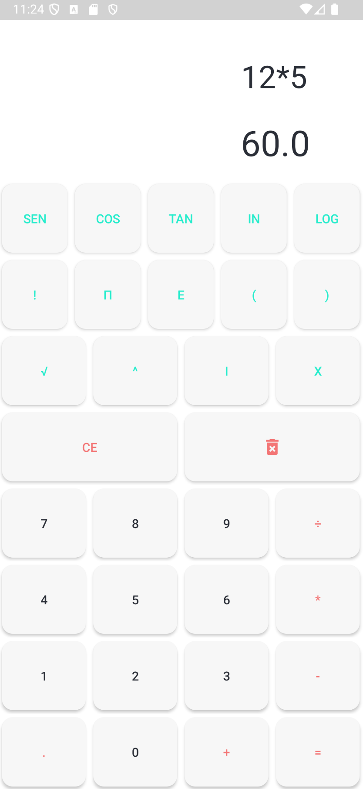
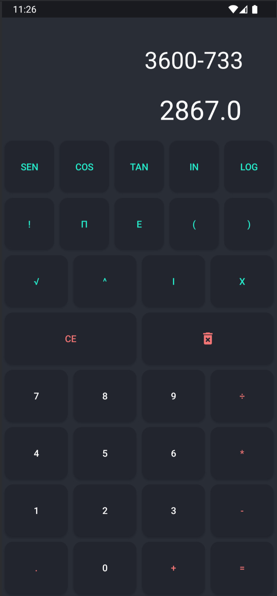

# Calculadora Android

<p align="center">
  
  
</p>

Aplicativo de calculadora com suporte a **tema claro** e **tema escuro**.

## 📱 Instalação

Para testar o aplicativo diretamente, você pode baixar o APK aqui:

🔗 [Download do APK](https://github.com/Messyas/Calculadora/blob/main/app/src/main/res/zapk/app-debug.apk)

## ⚙️ Execução do Projeto

Este projeto foi desenvolvido utilizando **Android Studio**. Para rodá-lo localmente:

1. Clone o repositório:
   ```
   git clone https://github.com/Messyas/Calculadora.git
   ````
   ````
   Abra o projeto no Android Studio.
   ````
   ````
   Conecte um dispositivo Android ou use um emulador.
   ````
   ````
   Execute o app clicando em Run (ícone ▶️ ou Shift + F10).
   ````
   

